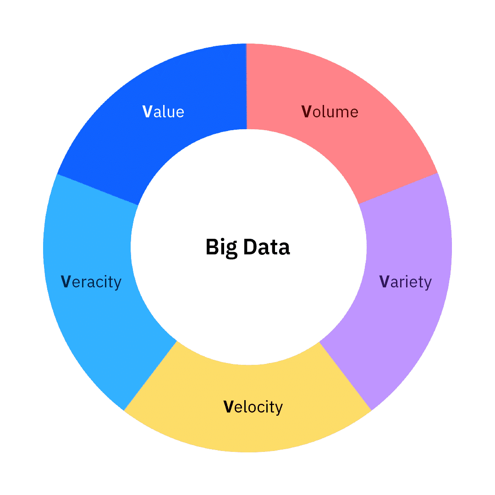

***BIG DATA***

In a digital world, everyone that uses connected devices leaves a trail of data. The term for this kind of data is **big data**

The term "big data" has been around for years, but there isn't a universal, official definition of big data. 

**Everything people do leaves a trace that can be analyzed**

    “The basic idea behind the phrase ‘Big Data’ is that everything we do is increasingly leaving a digital trace (or data) which we (and others) can use and analyze to become smarter. The driving forces in this brave new world are access to ever-increasing volumes of data and our ever-increasing technological capability to mine that data for commercial insights.”

Source: Big Data: Using SMART Big Data, Analytics and Metrics To Make Better Decisions and Improve Performance by Bernard Marr, 2015

**Big data is more complex and can tackle new problems**

        “Put simply, big data is larger, more complex data sets, especially from new data sources. These data sets are so voluminous that traditional data processing software just can’t manage them. But these massive volumes of data can be used to address business problems you wouldn’t have been able to tackle before.”

Source: [What Is Big Data? - Oracle](https://www.oracle.com/big-data/what-is-big-data/#defined)

**Big data demands innovative processing to het insights**

        “Big Data is high-volume, high-velocity, and/or high-variety information assets that demand cost-effective, innovative forms of information processing that enable enhanced insight, decision making and process automation.”

Source: [Gartner](https://www.gartner.com/en/information-technology/glossary/big-data)

************
***The 5 V's***

The elements of big data can be explained using five broad characteristics called the 5 V’s. The 5 V’s are **Volume, Variety, Velocity, Veracity, and Value.** The 5 V’s help data scientists make sense of what they are working with and are depicted in this diagram.

**Volume**

What amount of data do you need to process?
**Volume** refers to the vast amounts of data being generated.

- The increasing amount of data sources drives the volume of data. Think about it: as of 2022, the world population is nearly eight billion people, and the majority of people are using digital devices. These mobile devices, computers, phones, game consoles, and tablets all generate, capture, and store data.
- Companies need to use tools and storage that enable them to handle such large volumes of data. 

**Variety**
Is the data structured or unstructured?

*Variety* refers to the different types of data to use.

- Companies need to use different types of tools and techniques to handle the variety of data.

**Velocity**
How quickly is the data being generated from its diverse sources?

*Velocity* refers to the incredible speed at which new data is generated and the speed at which it moves around.

- Data is constantly moving and being generated extremely fast. It’s a process that never stops.
- There are near-time or real-time streaming and local and cloud-based technologies that can process information very quickly.
- Companies need to know how fast data is moving, from the time a data sample is taken to the time it is used. It can and does change.

**Veracity**
How accurate is the data?

**Veracity** refers to the quality and trustworthiness of data.

- You must consider the origin of data to make sure it is complete, has integrity, and is traceable.
- With the many forms of big data, quality and accuracy can be less controllable. For example, a tweet might contain hashtags, abbreviations, typographical errors, and colloquial speech.
- Companies need budget and methods to ensure that data is clean and trustworthy. This is an area of focus for data scientists.

**Value**
Can you extract value and insights from the data? 

**Value** refers to the ability to turn data into value. The main reasons why people invest time to understand big data is to derive value from it.

- Value isn’t just profit. It might be medical or social benefits, or it might be customer, employee, or personal satisfaction.
- Companies must make a case and have a clear understanding of the value they want to obtain from collecting and using big data. They must filter out the “noisy” data to find what they are looking for.

To take a look before: 

[Our Digital World and Big Data](https://www.futureoftech.org/big-data/1-our-digital-world-and-big-data/)

[Big Data in Pratice](https://bernardmarr.com/big-data-in-practice/)

