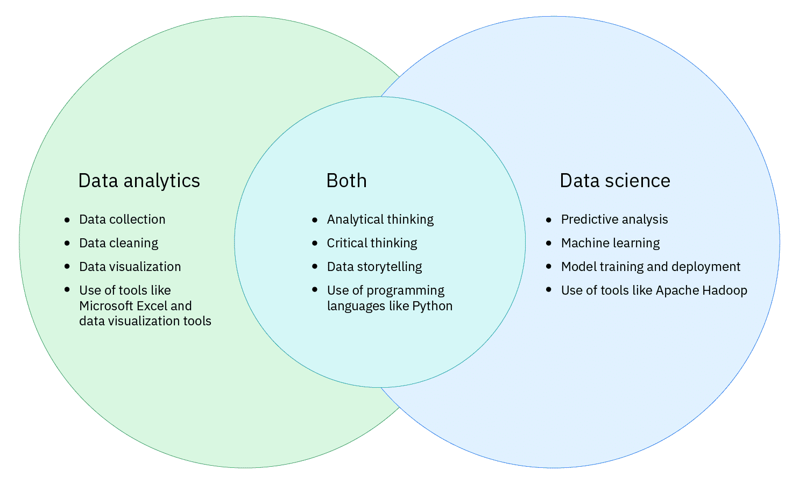
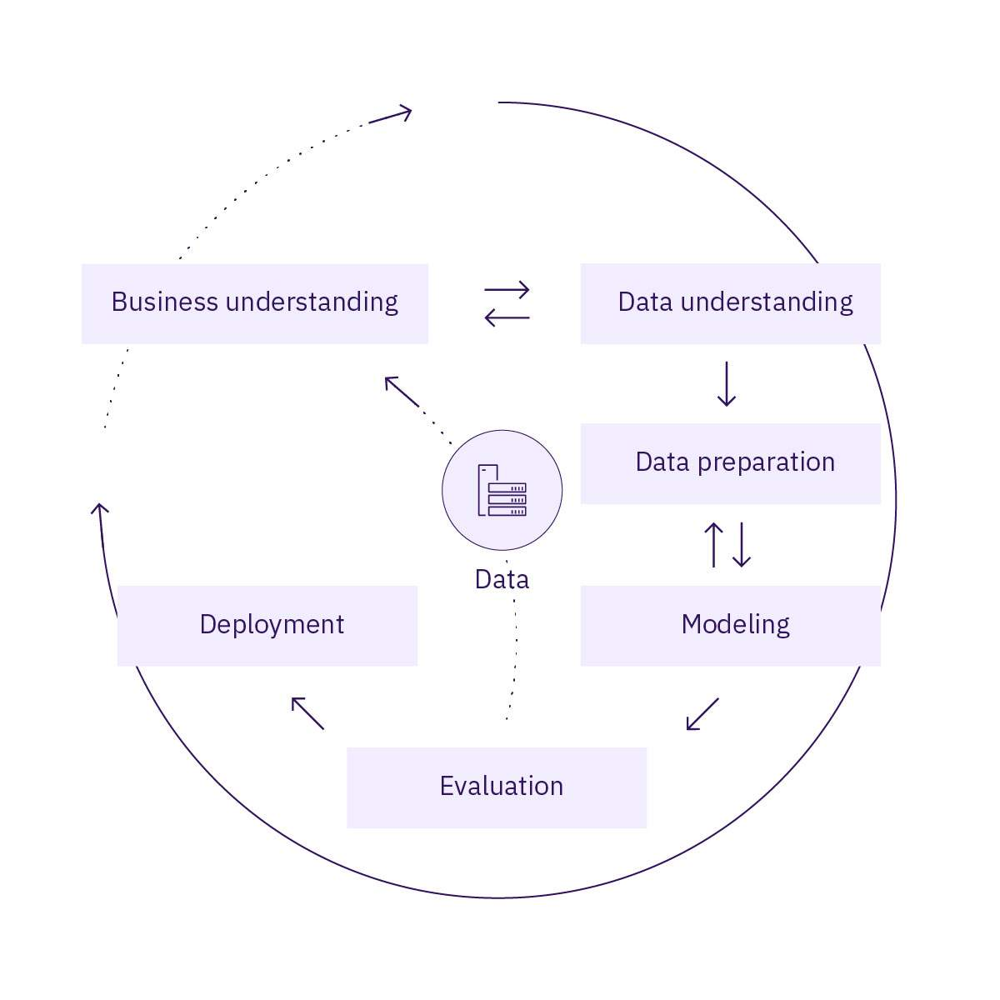
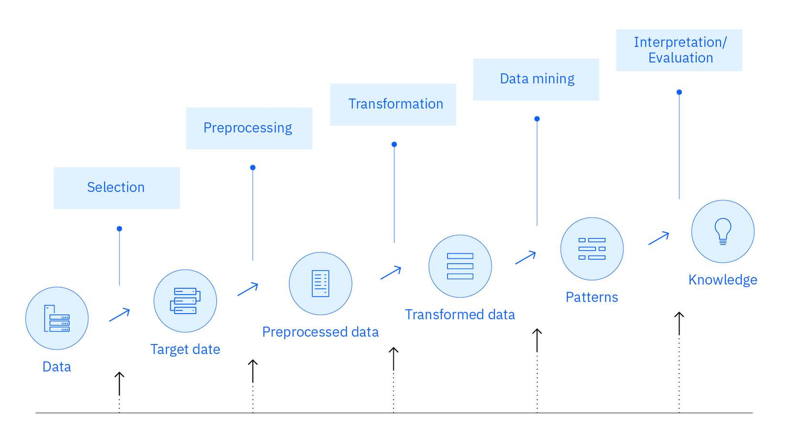
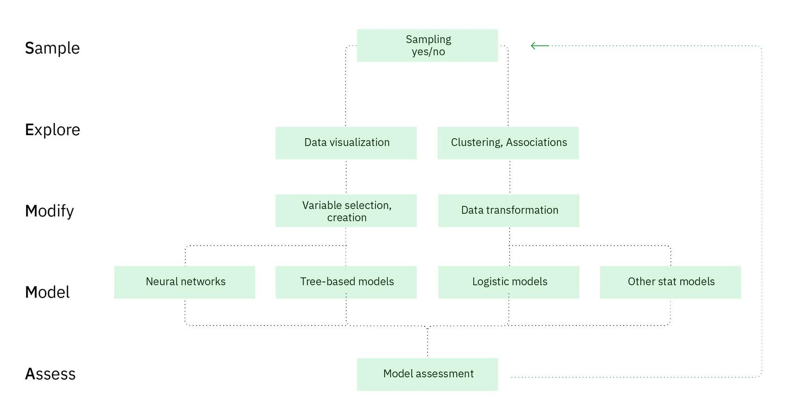
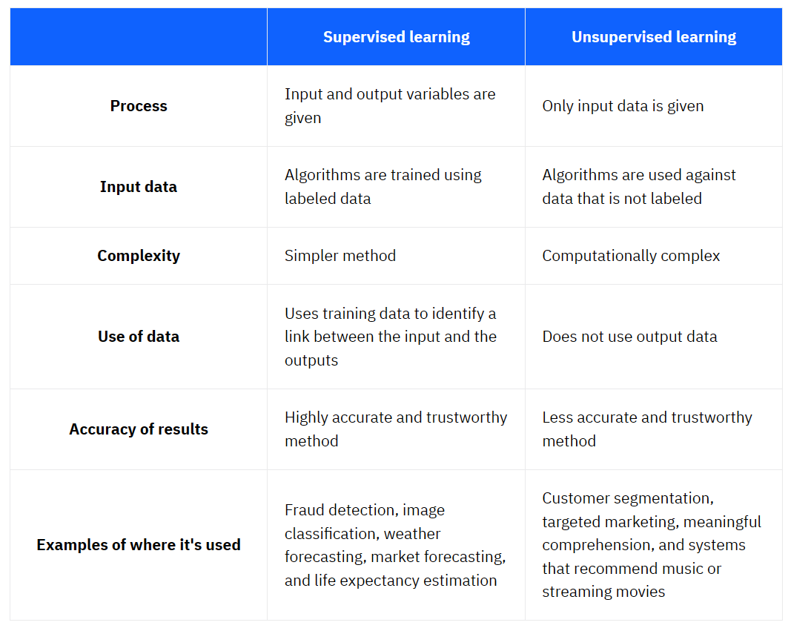

***DATA SCIENCE***

Data science is the understanding of the world through the scientific analysis of digital data.

The goal of data science is to extract value from data in all its forms.

**Data is a commodity.** Businesses need ways to process data to find its value. Data science is a scientific process that’s repeatable. That’s not to say data science is mechanical and void of creativity. But data processing—from collecting data sources and data cleansing to machine learning and eventually visualization—includes unique steps that are involved in **transforming raw data into insight.**

***THE 5 WHYs***

When analyzing data, you’ll find a problem and need to **understand why**. The 5 Whys(opens in a new tab) is a valuable technique in problem solving that is easy to remember.

First ask a "Why?" question, get an answer, and then ask a second "Why?" question. And so on! Each answer will inform your next "Why?" question. The answer to the fifth "Why?" should reveal the **root cause of the problem.**

**When using the 5 Whys technique, avoid assumptions and the temptation to skip to the obvious answer!**
************

***Data analytics vs Data Science***

Both fields work with data, and they share the same goal: to translate data analysis into business intelligence.

- **Data analysts** collect and examine large data sets to identify trends, forecasts, and data visualizations to tell a compelling story through actionable insights. These insights help businesses make informed decisions about business needs.
- **Data scientists** design and create new processes for data modeling. They use algorithms, predictive analytics, and statistical analysis. Data scientists have technical skills to arrange unstructured data and build their own methodologies to make predictions based on data trends.

source : [Data Analytics vs. Data Science by CompTIA](https://www.comptia.org/content/guides/data-analytics-vs-data-science)

**********
***Methodology***

Classic and widely adopted data science methodologies:

Cross-Industry Standard Process for Data Mining (CRISP-DM)
Knowledge Discovery in Database (KDD)
Sample, Explore, Modify, Model, Assess (SEMMA).

- Use data mining methods
- Are best suited for structured data
- Are useful for using descriptive and predictive analytics
- Share some common activities, such as data gathering, data transformation, data modeling, and model evaluation

**These methodologies are not useful on projects that work with unstructured data, such as images and text.**

**CRISP-DM** Cross-Industry Standard Process for Data Mining

CRISP-DM consists of six phases with arrows indicating the most important and frequent dependencies between phases:

- Business understanding
- Data understanding
- Data preparation
- Modeling
- Evaluation
- Deployment

The sequence of the phases is **not strict**. CRISP-DM is **iterative**, meaning that the phases can be repeated to incrementally improve the result.

What’s **unique** to the CRISP-DM methodology is that it **begins with Business understanding.** This phase focuses on understanding the project objectives and requirements from a business perspective, and defining the data problem to solve. 

***********

***KDD*** Knowledge Discovery in Database.

KDD typically has five steps:

- Selection
- Preprocessing
- Transformation
- Data Mining
- Interpretation/Evaluation

The KDD methodology can help businesses stay current with customer needs and behaviors and predict future purchasing trends to stay competitive. But, the process doesn’t address many of the modern realities of data science projects, such as the setup of big data architecture, considerations of ethics, or the various roles in a data science team.

***SEMMA***

SEMMA stands for its five steps:

- Sample
- Explore
- Modify
- Model
- Assess
  
SEMMA is a data science methodology that helps convert data into knowledge. SEMMA can help solve a range of business problems, such as fraud identification, customer retention and turnover, database marketing, customer loyalty, market segmentation, and risk analysis.

*********

The three methodologies are all iterative! This means that the phases or steps can be repeated. Knowledge acquired can be cycled back into the process to gain more or different insights.

*************************

***Data Models***

A data model identifies the data, data attributes, and relationships or associations with other data. A data model provides a generalized view of data that represents the real business scenario and data. 

Methods for machine learning: 

**Suipervised Learning**

In supervised learning, a machine ingests many questions and their answers—essentially a set of pre-structured information. The information might, for example, be drawings and photos of animals, some of which are dogs and are labeled “dog”. The machine attempts to  identify patterns so that when it sees a new photo of a dog and is asked, “What is this?”, it can respond, “dog”, with high accuracy.

Supervised learning trains machines on data to build general rules that can be applied to future problems. The better the training set of data, the better the output.

**Unsupervised learning**

In unsupervised learning, a machine ingests an enormous amount of information, asked a question, then allowed to determine how to answer the question by itself. For example, a machine might receive many photos and articles about dogs. The machine ingests and classifies the information within all of the photos and articles. When the machine is shown a new photo of a dog, the machine is intended to be able to identify it as a dog, with reasonable accuracy.

Unsupervised learning trains machines on a huge volume of unlabeled or unstructured data. 

**Reinforcement Learning**

Humans and machines can learn through reinforcement learning. Reinforcement learning is a feedback-based, machine-learning technique. Through reinforcement learning, a machine determines how to behave in an environment by performing and observing the results of its actions. For each “good” action, the machine receives positive feedback (a reward). For each “bad” action, the machine receives negative feedback (a penalty). As a result, the machine learns automatically, through its experience and feedback.

Reinforcement learning doesn’t involve a specific goal. Rather, it involves learning from trial and error or “learn as you go”. Reinforcement learning is widely used in self-driven cars, drones, and other robotics applications. 

