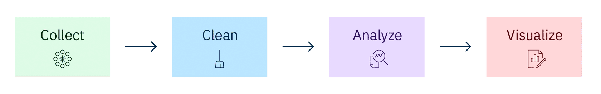

***Collect, Clean and Transform***

Before beginning a data analysis project, a good starting point is to have a business objective in mind and a clearly defined problem. What questions do you want to answer? After all, 90% of analytics is asking the right questions! You must also determine the metrics to measure performance. What are you measuring and how are you measuring it?

Charles Ito thoughts for each step:
***Collect***

        “This is ‘square one’ in the process. This step is all about collecting the right data and just enough data for the project’s questions or problems that we want to research.

        I first determine the data I can collect from any existing sources and databases that we already have that relate to the problem my company wants to solve. I always collect this data first! 

        Then, I figure out if my project needs new sources of data because this could mean more time for the project and potentially more of an investment from my business group. 

        My team and I use our company’s data collection tools and follow the data collection guidelines. We’re careful to securely store the data on our cloud servers, too.  

        One crucial point I’d like to make is you have to collect enough in your data set, so you don’t skew the results of your analysis.”

***Clean***

        “Next, not all the data I collect will be useful, so it’s time to clean it up!  

        Data cleaning is the process of detecting and correcting missing or inaccurate records from a data set. 

        A big part of this step is making sure that the data is in a usable format. This involves searching for what we call ‘outliers,’ dealing with null values, and looking for data that may have been incorrectly input. Simply put, raw data will have missing and inaccurate values that I need to address. 

        You might have heard the term, ‘data wrangling’. I ‘wrangle’ the data so it’s in a usable format for my project in our database system. For example, I will search for duplicate records and remove them. 

        No two data sets are the same, so how I clean the data can vary. I clean the data based on the context. In one case, seeing a blank entry might equal a zero entry, so it’s good and valuable data. But, in another case, seeing a blank entry could mean it’s incomplete data that I need to exclude. This is the art of data science!

        Always save your data since this is an iterative process!

        Oh, and here’s an interesting fact. This is where I spend most of my time, cleaning the data! I’d estimate that data analysts typically spend about 70-80% of their time cleaning data. It’s a lot of hard work. But, it’s a must so I can move on to analysis.”

***Analyze***

        “Once I have the relevant data and it’s cleansed, it’s time to analyze. This is the step where data analysts spend about 20-30% of their time. It’s the fun and rewarding part!

        I get to be curious and investigate. And, my problem-solving skills come into play. Here, I use different statistical and analytical methods and software tools. It’s important that I align my methods of analytics, so they match the intent of the problem.

        Basically, I identify issues and use analytics to determine the root causes of issues. I analyze trends, correlations, variations, and outliers to help me focus on answering the questions (and any questions or objections others might have).

        As I manipulate data, I might find I have the exact data I need, but, more likely, I might need to revise my original questions or collect more data. This can drive additional analysis and is one reason to always save your data.”

***Visualize***

        “After analyzing the data, I interpret the results. I think about, ‘What did I learn from the results of my analysis? Does the data answer my original questions? How?’ 

        To interpret the results, I create data visualizations. They help me compare data sets and observe relationships. We have a couple of tools that I just love using for this.

        And, once I can make my conclusions, the visualizations help me graphically show my results in a way my team and leadership can easily and concisely understand them. I find I often choose bar charts, line graphs, scatter charts, and maps. I like figuring out the best way to depict the data.

        We typically have a team presentation and meeting to review the results and data visualizations. Our goal is to make sure the insights that I’ve concluded can be applied to the business problem and we can take actions, or make changes, or refocus efforts however is needed. 

        This step is a good ending to the process. It’s all about gaining insights from the data and being able to apply the insights to the business.”

*******************

***Extract, Transform, and Load (ETL)***

The term “ETL” used in computer-based work environments, in relation to data, data warehousing, and analytics.

ETL is a data integration process that combines data from multiple data sources into a single, consistent data store that is loaded into a data warehouse or other target system.

As databases grew in popularity in the 1970s, ETL was introduced as a process for integrating and loading data for computation and analysis, eventually becoming the primary method to process data for data warehousing projects.

ETL provides the foundation for data analytics and machine learning workstreams. Organizations often use ETL to:

- Extract data from legacy systems
- Cleanse the data to improve data quality and establish consistency
- Load data into a target database

Source:

[What is ETL (Extract, Transform, Load)?, IBM Cloud Learn Hub, April 2020](https://www.ibm.com/think/topics/etl)
