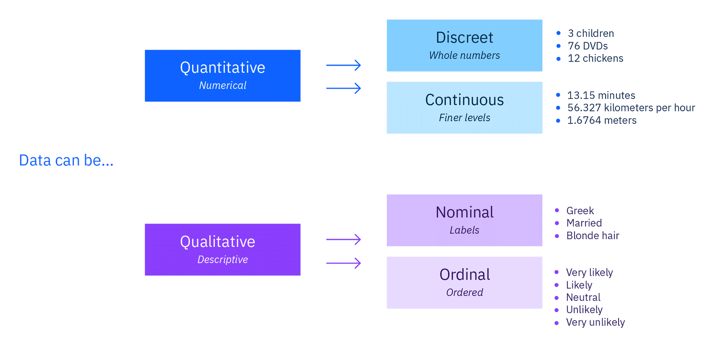

***Types of data***
Differences between unstructured and structured data, purposes of a database and differences between quantitative and qualitative data.
************

**Why is data so important?**

Today any business that has a website or  a social media presence an that accepts electronic payments is collecting data. Businesses collect data about customers, user habitsm, web traffic and demographics, and more. **All of that data is filled with potential if you can learn how to find it**

Data is one of the most valuable assets organizations can have, wheter is businessm finance, healthcare, retail, technology,marketing or other industries. The number of companies usign data insights continues to grow, Data insights have the potencial to help many companies to: 

- Improve operations
- better understand END users or customers
- Drive efficiency
- Reduce costs
- Increase profits
- Find new inovations

**Data is a problem solver**. Analysts make sense of data.They follow a process to **gather, cleanse and transform** data with the objective of obtaining insight freom the data to answer the question. The goal is to use the insights **to help make better and informed decision, and solve problems**

In [this arcticle](https://earthweb.com/blog/how-much-data-is-created-every-day) made by Jason Wise for Earthweb, the author says that 3.5 QUINTIllion bytes of data is created **every day!** Much of this increase of data is justified by the increased usage os smartphones among people and the rise of digital business possibilities due to the Covid-19 situation have become the primary reasons for data usage growth.

In 2025, global data creation is projected to grow to more than 180 ZETTAbytes(A zettabyte is a number 1 followed by 21 zeroes!).

Today 80% of storaged data is unstructured(Audio,Video,Image,Documents) and the 20% is structured(Databases, formatted files)

***DATA can be structured or unstructured***

Data is **raw information**. Data might be facts,statistics,opinions, or any kind of content os content that is recorded in some format(voices, photos, names...)
 So, when data analysts handle raw information to uncover its story, they start by organizing data into two forms: Structured or Unstructured data. The difference betwwwn these types of data changes how analyysts work with them.

 **Structured data**

 Is information that can be organized in rows and columns(also seen in a spreadsheet,like excel...) For complex information, data nalysts use tools like SQL(Structured Query Language) which can sort through vast amounts of data stored in many connected tables. If you can organize information within data into groups, based on specific characteristcs, then thos groups are stgructured data.

 Structured data is the most useful form of data because it's highly organized and can be manipulated.

 **Unstructured data**

 Refers to "everything else". There is no predefined format.It"s a conglomeration of varied types of data that are stored in their original formats

 Examples of unstructured data include images, texts, social media posts, like tweets, customer comments, medical records, and even song lyrics.

Unstructured data can be **harder to work with compared to structured data**. Yet unstructured data **reveals what people don't know-the unknowns**

Suppose a software company is getting a lot of email bug reports about a new release. The text of those emails is unstructured data. But, by examining those texts (and perhaps by converting some of their contents to structured data), a data analyst can figure out patterns, such as the sentiment of the text, and identify the problem so the company can fix it!

*************
**Databases**

Data analysts spend a lot of time working in a database. A db is an organized collection of structured data in a conputer system. Thikn of a database as a container or repository with many columns and rows. A database makes data highly organized, so the data is easily accessible by **queries and computation software**

**Transforming data into standard format (or tidy data) makes storage and analysis easier.**

Most databases are organized as relational databases. Relational databases are collections of multiple data sets or tables that link together.
**************
**Think of data as qualitative or quantitative**

A key concept to know is that most data falls into one of two groups: quantitative or qualitative.

**Quantitative:**

Relates to **numbers**
- Is also called **numerical data**
- Represents thing that **can be measured and assigned values**
- Can be counted and measured, suach as height, weight,length,blood pressure...

**Qualitative:**

Relates to **words and descriptions**
- Is also calleg **categorical data*
- Represents the characteristics, attributes, properties, and qualities of things
- Describes data using language(rather than numbers), suach a smell, location,color, texture, marital status...

**More data distinctions**
The way you choose how to use the data in the correct way is important!

Moving slightly into statistics, here are a couple more distinctions about quantitative and qualitative data:

- Quantitative can ve **discreet** or **continuous**
- Qualitative can be **nominal** or **ordinal**

*********

Quantitative -> **Discreet**(Whole numbers)

Includes integers or whole numbers that can't be divided, sucha as the numer 1 or 9.

For example, the number of rooms in a hoyse or the number of people in a movie theaters is descrete data because you can only count **whole individuals**. You can't count 1.7 people.

Quantitative -> **Continuous**(Finer levels)

It’s the opposite of discrete data.

Continuous data can be divided into finer levels and take any value,can be divided into many decimal places. It can be measured on a scale or continuum.

There is an infinite number of possible values. For example, the weight of a car can be calculated to many decimal places, height, weight, and length are all gorms of continuous data, some continuous data can change over time, such as the speed of an airplane or the temperature in a room
***********

Qualitative -> **Nominal**(from "name" or label)

It's a name or label for data, such as, “My friend is Italian. Her name is Maria. She has brown eyes.”

Nominal data labels variables without any quantitative (or numerical) value. Nominal data can be grouped into categories, but it doesn’t have a meaningful order or hierarchy.

Some examples of nominal data is hair color(blond, black or brunnete), Religion(Christian or Buddhist), Marital status( single, maried or widowed), ethnicity(Asian or hispanic)

Qualitative -> **Ordinal**(placed into an order by position on a scale)

For example:
- School letter grades (such as A, B, and C), sizes (such as small, medium, and large), and customer satisfaction survey levels (such as satisfied, neutral, and dissatisfied) are ordinal scales.
- In data collection and research, ordinal scales are commonly used to measure perceptions and opinions (such as, “How likely are you to recommend…”).