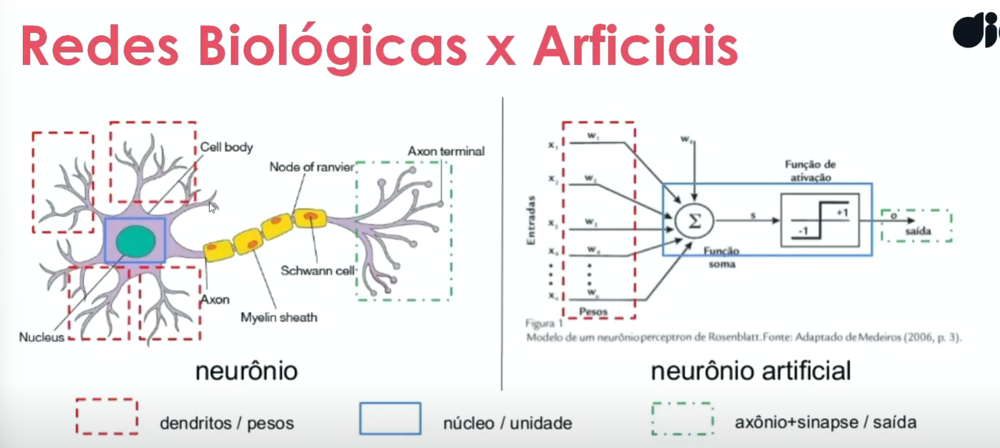
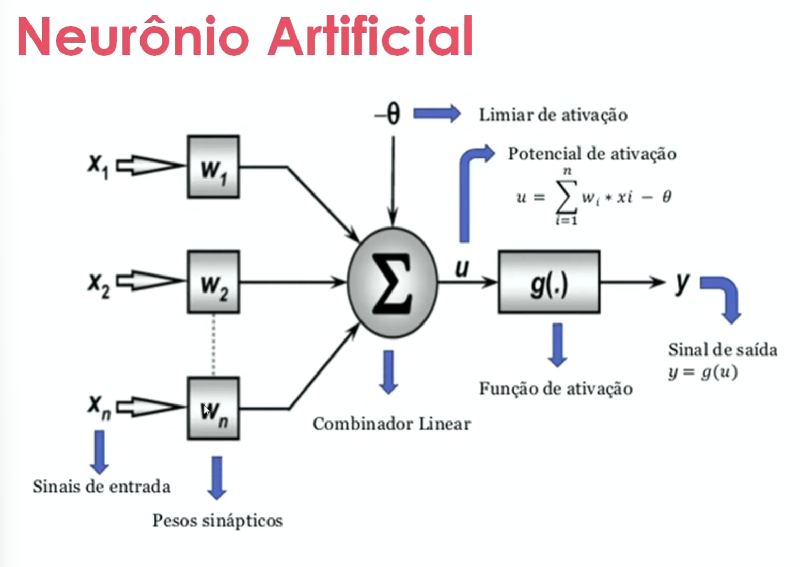
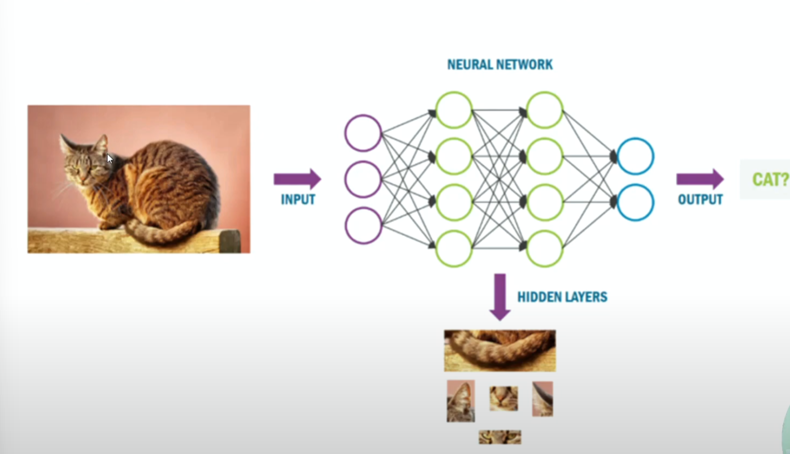
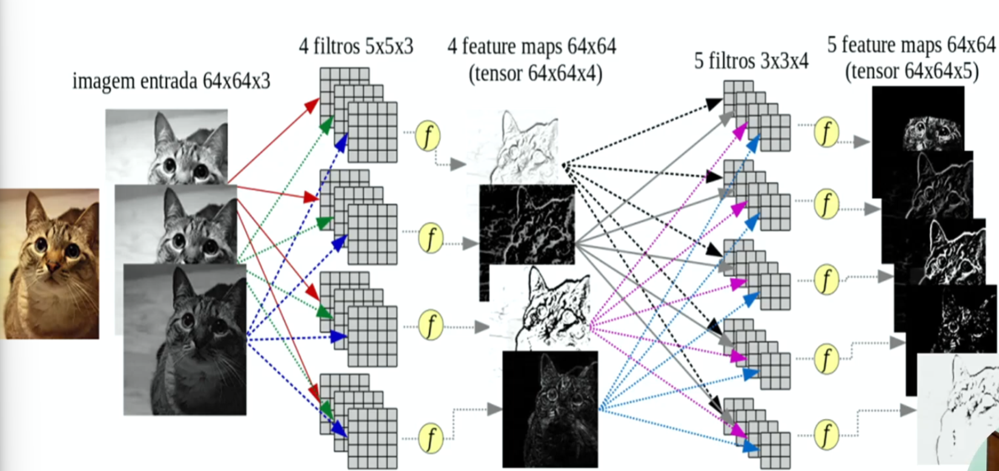

***Inteligencia artificial restrita***

***Aprendizado por reforco***

Igual treinar um cachorro, voce da biscoito quando ele faz certo

No caso da maquina damos um peso positivo caso ele acerte e negattivo caso erre

***Libs***

Scikit learn
Pandas

COLAB : Ferramenta online de ML

*****************************

***Machine Learning Bioinspirados***

Machine Learning nasce do pensamento de "como uma pessoa faria" e a partir dai buscamos chegar perto dessa reposta porem feita com IA e eliminando problemas que uma pessoa costuma cometer

Ja o bioinspirado isso e buscado em animais. Buscar a resposta em animais e obter respostas transformando em algoritmos

- Inspirados no comportamento de seres vivos em convivencia social
- Conhecimento colaborativo/compartilhado
- Metodos heristicos(nao deterministicos)
- buscam a melhor solucao global

*deterministico 2+2 = 4 SEMPRE pois e deterministico, no caso do heuristico temos varios solucoes e buscamos a melhor solucao dentre elas

***Heurisricos e Deterministicos***

Deterministico

2+2=5
nao! 2+2 e 4

boolean sempre vai ser Verdadeiro ou Falso

Heuristico

pego 10 pessoas e pergunto qual a mais bonita
as respostas nao vao ser as mesmas e nem definidas com antecedencia

tem varios valores entre 0 e 1

**No mundo real** as respostas nao sao extas

O que e mais utilizado hoje sao Redes Neurais Artificiais(RNA) inspirada em neuronios

**************************
***Redes Neurais***

Estrutura de uma Rede Neural Artificial

neuronios
conjunto de neuronios pre definidos
conjunto de dados que foi usado para ser treinados

Um Neuronio artificial e um algoritmo com valores de entradas e de saida 

Por se tratar de RNA trabalhamos com heuristicas, e aqui temos de escolher a melhor escolha possivel dentro a que temos, por exemplo num caixa eletronico ao pegar sua digital dificilmente ele vai ter 100% de acuracia, entao ele vai trabalhar com a maior % que ele conseguir

***Dados de entrada e de saida***

Como uma rede consegue determinar padroes com base no que foi amostrado?

Esse mapeamento e feito por matrizes, a imagem nao e passada inteira, primeiro pega algumas partes da imagem e vai mapeando e depois comparando, por fim ele salva formas chave, a propria rede decide o que considerou importante ou nao e nos mostra(mapa de caracteristicas)

Caso a imagem seja colorida e gerado 3 imagens a partir dela separando seus canais RGB, se nao for necessario e melhor deixar como em PeB

Nos nao conseguimos ver como e feito esse processamento, a gente sabe que ele esta ali mas nao tem detalhes de escolhas ou caminho feito pela rede

***Problemas de classificacao***

Sao os problemas mais "famosos" em que redes sao usadas e trabalhadas atualmente,problemas de classificacao sao:
- isso e um gato?
- quem e esse aluno dessa escola

Para criar um DATASET, colocamos em um diretorio fotos do objeto a ser rotulado, um numero bom e 100 fotos ( que entrega um bom resultado em bom tempo) mas nada impede de colocar 1000 fotos, vai demorar mais mas o resultado vai ser mais acertivo