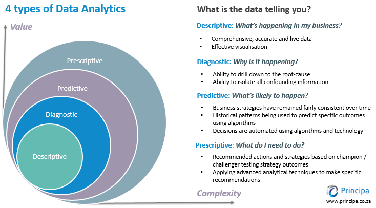

***Types of data analytics***
A successful data analytics initiative can provide a clear picture of where you are, where you have been, and where you should go.

IT industry typically recognizes four types of analytics:

- Descriptive
- Diagnostic
- Predictive
- Prescriptive 

Each type has a different goal and a different place in analysis process, and answers a specific question. 

*************

***Descriptive - What is Happening?***

Is the simplest and most common type of data analytics

Answers the question, “What is happening?”. It provides a snapshot of business trends and patterns and uses historical and current data.

Descritive manipulates raw data from multiple sources to give a data analyst valuable insights into the past and a view of key metrics within a business.These findings might signal that something is right or wrong **but not explain why**. However, the findings can help to determine what the biggest issues are and **where to start investigating!**

Examples: 

- The number of subscribers for a service
- Customer satisfaction survey data
- Monthly revenue reports
- Daily stock reports
- Demographic data about a business’ customer population, for instance, data that indicates that 30% of customers are self-employed

****************

***Diagnostic - Why is it happening?***

After asking the question, “What is happening?”, the next step is to dive deeper and ask “why?”, such as,  “Why are trends and patterns happening?” This is where diagnostic analytics comes in.

Diagnostic analytics takes the insights found from descriptive analytics and drills down to find the causes of specific problems. Businesses use of diagnostic analytics because it creates more connections between data and identifies patterns of behavior

Examples: 

- A freight company investigates the cause of slow shipments in a certain region.
- A healthcare company examines diagnoses and prescribed medications to identify the influence of medications.
- An IT company analyzes server ticket data to identify a small number of servers causing the bulk of an organization’s service outages.

******************

***Predictive - What is likely to happen in the future?***

Predictive analytics is about forecasting.Uses historical data to make predictions about the future.

Being able to predict allows businesses to make better decisions. This type of analytics is more advanced and can often depend on machine learning and deep learning.

Examples:

- A software company uses customer segmentation to determine sales leads.
- An automotive manufacturer forecasts the failure rate of a specific vehicle part to determine recommended service actions.
- A weather forecaster analyzes current weather conditions in one part of the world to determine future weather conditions in other parts of the world.

**********

***Prescriptive - What should happen?***

Prescriptive analytics combines the insight from all previous data analyses to determine a course of action to take to address a problem or make a decision.

Prescriptive analytics is typically used for a host of actions, versus an individual action. This requires a major commitment from businesses to put forth the strategy, effort, and resources. As technology continues to improve and more professionals are educated in data, more companies will enter this data-driven realm. Uses advanced tools and technologies, like machine learning, business rules, and algorithms. This makes prescriptive analytics sophisticated to implement and manage.

Examples: 

- A traffic application that helps people choose the best route home and considers the distance of each route, the speed at which one can travel on each road and, crucially, the current traffic constraints
- An exam timetable that checks if students have conflicting schedules
- Artificial intelligence (AI) systems from data-driven companies like Facebook, TikTok, and Netflix

*************

Each type serves a different purpose and provides varying insights. Moving from descriptive analytics towards predictive and prescriptive analytics requires much more technical ability but also unlocks more insight for organizations.

Sources:
[4 Types of Data Analytics to Improve Decision-Making, ScienceSoft, by Alex Bekker, May 2019](https://www.scnsoft.com/data/4-types-of-data-analytics)
[The 4 Types of Data Analytics, KDnuggets, by Thomas Maydon, July 2017](https://www.kdnuggets.com/2017/07/4-types-data-analytics.html)
[Types of Data Analysis, Chartio Data Tutorials, by Patrick Gibson, 2021](https://chartio.com/learn/data-analytics/types-of-data-analysis/)